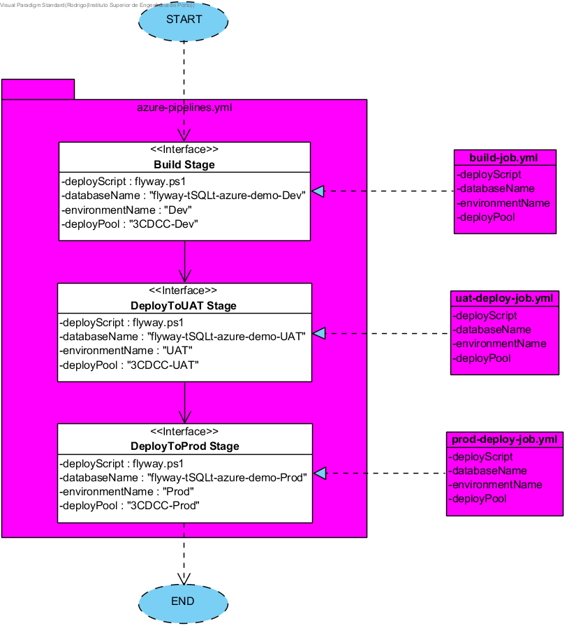
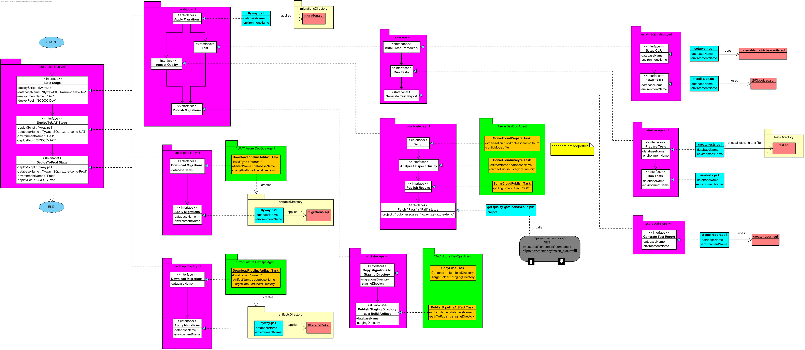

# Design

The pipeline is broken down into multiple files that implement its Jobs, Steps and Tasks.

"azure-pipelines.yml" is the root or entry point of the pipeline:

Abstractions are coloured in white. Theses entities do not depend on the set of tools being used. In this case, the "Build Stage" Abstraction is implemented by the "build-job.yml" file, the "UAT Stage" by the "uat-deploy-job.yml", and so on. There are design diagrams similar to this one for each of these files.

For added visual flair, design objects are color-coded:

Blue - PowerShell file

Green - Azure DevOps Agent. Represents an Agent needed to run non-PowerShell tasks (e.g. "DownloadArtifact", "PublishArtifact")

Orange - Azure DevOps Agent Task. A non-Powershell task that only an Azure Agent can accomplish. The less of these there are, the less dependent the pipeline will be on Azure DevOps itself - which will prevent vendor lock-in, and allow for easier transitions to a new tool if necessary (e.g. switching from Azure DevOps to TeamCity or GitLab CI/CD)

Purple - YAML file

Red - SQL file

White - Abstract Stage / Job / Steps / Task. Represents something that a pipeline must do, without concerning itself with HOW. In principle, these abstractions would remain in place even if we were to switch over to other tools in the future

Yellow (Faded) - directory

Yellow (Full) - note

The next diagram shows an expanded overview of the pipeline:

